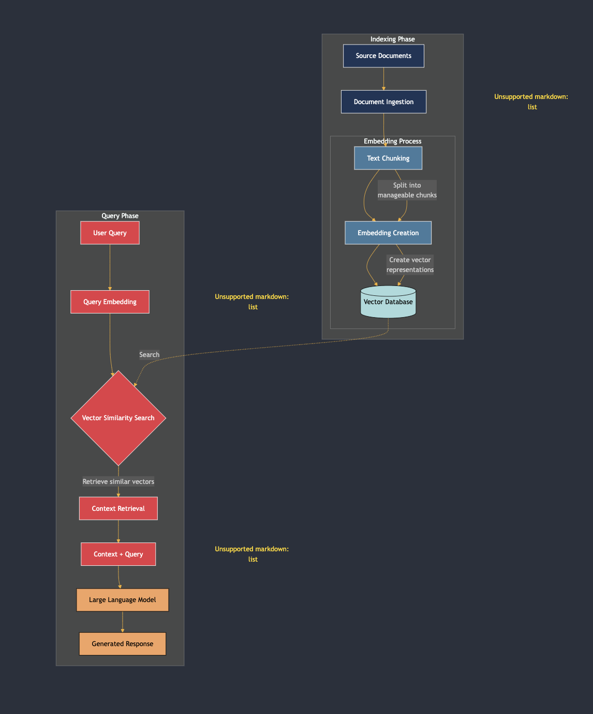
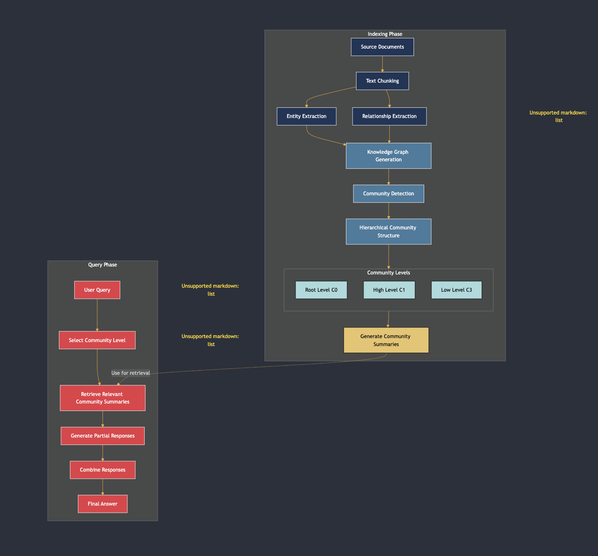
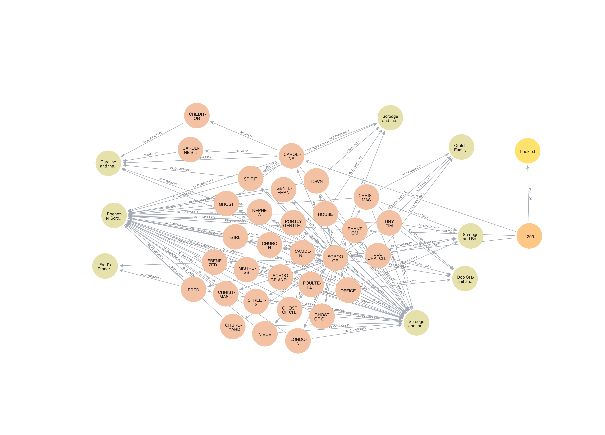
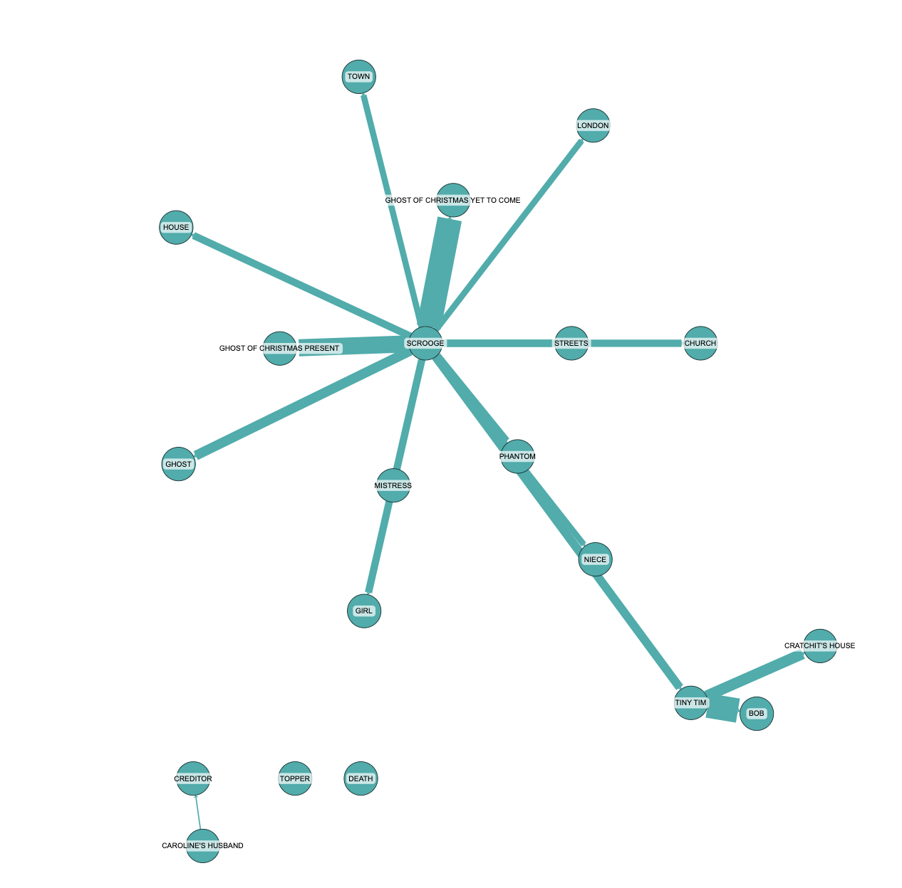

# Graph RAG: Advancing Retrieval Augmented Generation with Knowledge Graphs

## Introduction

In the ever-evolving landscape of artificial intelligence, a new player has emerged: Graph RAG. Recently open-sourced by Microsoft, Graph RAG combines the power of knowledge graphs with Retrieval Augmented Generation (RAG), promising to enhance the capabilities of traditional RAG systems. In this blog post, we'll dive deep into how Graph RAG functions, and experiment with a copy of A Christmas Carol by Charles Dickens from a trusted source.

## Understanding Traditional RAG

Before we explore the advancements of Graph RAG, it's crucial to understand the traditional RAG approach. RAG systems retrieve relevant documents from a vast corpus to generate contextually relevant responses. This process typically involves two main phases:

1. **Indexing Phase**: 
   - Original documents are divided into smaller chunks using a chunking strategy. 
   - Each chunk is converted into vectors and stored in a vector database, creating a knowledge base.

2. **Query Phase**: 
   - When a user submits a query, embeddings for the query are computed.
   - A similarity search is performed in the vector database to retrieve the most relevant chunks.
   - These chunks are then fed into a large language model (LLM) to generate the final response.



### Limitations of Traditional RAG

While traditional RAG systems have been revolutionary, they come with notable limitations:

- **Limited Contextual Understanding**: They may overlook nuances in the data, lacking a holistic view of the documents.
- **Scalability Issues**: As the corpus grows, the retrieval process can become less efficient.
- **Complexity**: Integrating external knowledge sources in a meaningful way can be cumbersome.

## Introducing Graph RAG

Graph RAG aims to tackle these limitations by leveraging knowledge graphs. Along with the code, Microsoft released a comprehensive technical report titled "From Local to Global: A Graph RAG Approach to Query-Focused Summarization".

### Technical Details of Graph RAG

Graph RAG consists of two primary phases: indexing and querying.



1. **Indexing Phase**: 
   - Documents are processed into sub-documents, similar to traditional RAG.
   - Graph RAG identifies entities (people, places, companies) and their relationships across chunks.
   - A knowledge graph is created - a set of nodes representing relationships between entities.
   - Communities of related entities are formed, and summaries are generated for each community.

2. **Query Phase**:
   - When a user submits a query, Graph RAG selects the appropriate community level based on the required detail.
   - It retrieves summaries from these communities to generate a final, coherent response.

This method enhances contextual understanding, addressing one of the main drawbacks of traditional RAG.

## Running Queries with Graph RAG

To demonstrate the power of Graph RAG, let's look at how it processes a classic piece of literature: "A Christmas Carol" by Charles Dickens. Here's a basic outline of how to execute a query:

1. Set up your Python environment and install Graph RAG:
   ```
   pip install graphrag
   ```

2. Get a copy of "A Christmas Carol":
   ```
   curl https://www.gutenberg.org/cache/epub/24022/pg24022.txt > ./ragtest/input/book.txt
   ```

3. Set Up Your Workspace Variables:
   ```
   python -m graphrag.index --init --root ./ragtest
   ```
4. Set Neo4j instance and ddd the element to neo4j database

5. Run a query to find communities of related entities in neo4j database:
   ```
   MATCH (d: __Document__) WITH d LIMIT 1 
   MATCH path= (d)<-[:PART_OF]-(:__Chunk__) - [:HAS_ENTITY]->()-[:RELATED] - () - [:IN_COMMUNITY] ->() 
   return path LIMIT 100
   ```

This query generates a knowledge graph, visualizing the relationships between entities in the story:



Explain knowledge graph:

1. **Entities**: Represented by circular nodes, including characters (e.g., "FRED", "BOB CRATCHIT"), locations (e.g., "LONDON"), concepts (e.g., "CHRISTMAS"), and source material ("book.txt").

2. **Relationships**: Shown as arrows connecting entities, such as "IS_COMMUNITY", "RELATED", and "IS_PART".

3. **Communities**: Groups of closely related entities, represented by different colors (e.g., orange nodes for the main storyline, yellow for source materials).

## Graph RAG in Action: Analyzing "A Christmas Carol"

To showcase the power of Graph RAG, let's look at how it analyzes the themes in "A Christmas Carol":



Graph RAG identifies several key themes:

1. **Transformation and Redemption**: Scrooge's journey from miserliness to generosity.
2. **The Impact of Generosity**: How Scrooge's change affects those around him, particularly the Cratchit family.
3. **The Importance of Family and Social Bonds**: Scrooge's reintegration into his family and community.
4. **The Consequences of Isolation**: The negative effects of living without meaningful connections.
5. **The Symbolism of Christmas**: As a catalyst for change and renewal.
6. **The Role of the Supernatural**: How the spirits guide Scrooge's transformation.

Response of query the themes in "A Christmas Carol"
```
The story of Ebenezer Scrooge is rich with themes that explore transformation, generosity, the importance of family, the consequences of isolation, the symbolism of Christmas, and the role of the supernatural. These themes are intricately woven into the narrative, providing a compelling tale of redemption and the enduring impact of kindness and community.
```

This analysis demonstrates Graph RAG's ability to provide a comprehensive, contextual understanding of complex narratives.

## Challenges and Limitations

While Graph RAG offers significant improvements in contextual understanding and query processing, it comes with higher computational costs. For example, processing "A Christmas Carol" through Graph RAG resulted in over 1 million tokens being processed, costing around $2 for a single run. This is considerably more expensive than traditional RAG systems, especially for larger datasets.

## Conclusion

Graph RAG represents an innovative approach to enhancing retrieval systems through knowledge graphs. While it excels in providing richer contextual understanding and addressing limitations of traditional RAG, the cost implications are something to consider carefully. As more organizations adopt this technology, comparing various implementations may help determine the best fit for specific applications.

Depending on the specific problems, you can consider which type of model to choose (possibly even a local model). In the setting.yaml file, you can adjust the setup to select the model. If you encounter any difficulties in setting up or experimenting with graph rag, let's contact our RnD team.

